

# 构窗 · AI 门窗导购平台

**让买门窗像点外卖一样有底 —— 看得懂、比得清、买得放心**

对话式导购 · 隐性需求推理 · 方案生成 · 本地商家匹配 · 真实成交评价闭环

  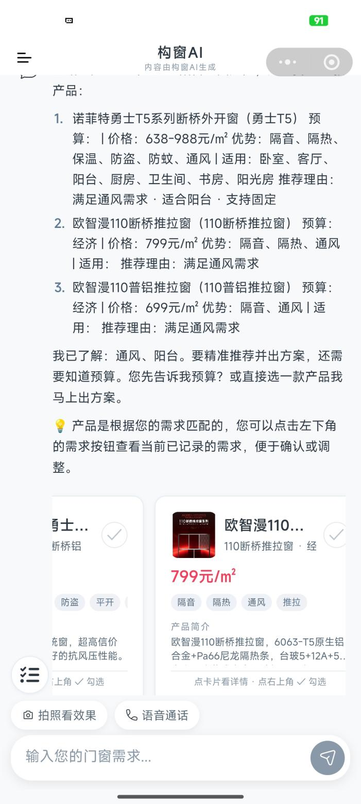
  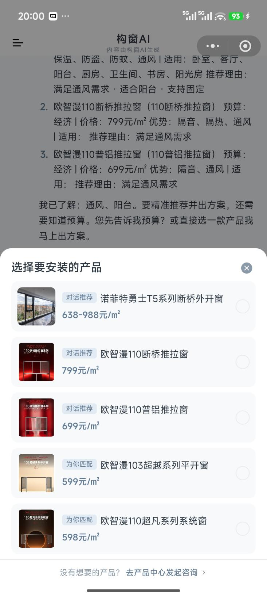
  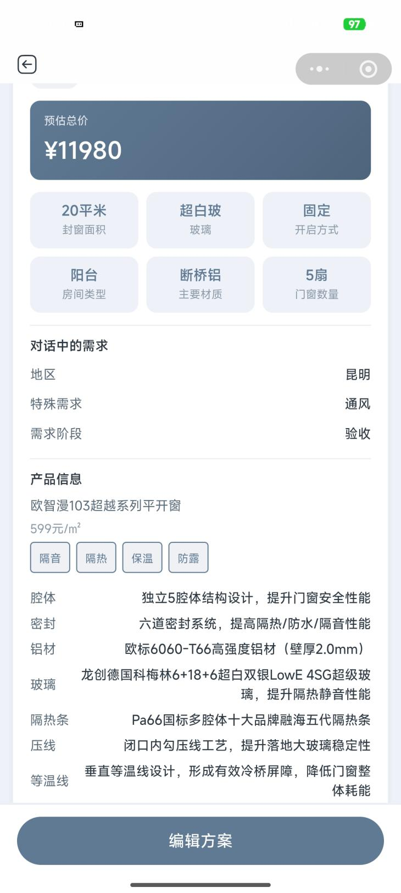

> 本仓库为**项目展示仓库**，用于呈现产品形态、业务闭环与技术架构，不含后端源码、数据与部署配置。

---

## 📖 目录

- [一、项目简介](#一项目简介)
- [二、市场机会](#二市场机会)
- [三、行业痛点](#三行业痛点)
- [四、解决方案](#四解决方案)
- [五、产品能力](#五产品能力)
- [六、商家端与评价闭环](#六商家端与评价闭环)
- [七、运营管理后台](#七运营管理后台)
- [八、技术架构](#八技术架构)
- [九、商业模式](#九商业模式)
- [十、路线图](#十路线图)
- [十一、仓库说明](#十一仓库说明)

---

## 一、项目简介

**构窗** 是一款基于大语言模型（LLM）与 LangGraph 多智能体技术栈的**门窗行业智能导购平台**。以微信小程序为主要载体（多端架构可扩展至抖音端，后期规划独立 App），把门窗选购中最难的三件事——**搞懂参数、理清需求、找到靠谱商家**——变成一问一答就能完成的事。

- **用户侧**：先科普知识，再渐进理清需求（城市 / 楼层 / 朝向 / 预算…），推荐产品、生成含明细与预估价的方案，匹配本地靠谱商家
- **商家侧**：入驻申请、产品上架、客户线索管理、评价管理、经营数据看板
- **平台侧**：入驻 / 产品 / 评价多重审核、成本监控、知识盲区运营，保障内容真实与服务质量

**当前状态：产品已上线运行。** 核心功能全部可用，覆盖对话、推荐、方案、商家、画像、自检全环节；进入商业化验证阶段，正推进本地商家入驻与种子用户推广（云南为首发阵地）。

| 核心指标 | 说明 |
|---|---|
| 技术架构 | LangGraph 多智能体（15 节点）三层协同 |
| 知识库 | 约 500 万字，覆盖国标到避坑经验 |
| 检索召回 | SQL + 向量 + BM25 三路并行召回 + Rerank 精排 |
| 幻觉控制 | 代码快速校验（零 LLM 成本）+ LLM 深度检查，引用 100% 可溯源 |
| 商业模式 | 成交佣金（约 5%）+ 用户返现（约 1%，凭证核验）|
| 首发市场 | 云南 —— 已获取本地商家与种子用户数据 |

## 二、市场机会

- **万亿级、高分散**：门窗行业全年市场规模已跨过万亿门槛（2026 上半年产值近 7,000 亿元），2020–2025 年复合增速约 6.9%；行业极度分散、区域性强，为「本地商家匹配」留出巨大的平台化空间
- **增长逻辑切换**：从新房扩张转向**存量房升级换代**，需求更稳定、长期性更强
- **政策双轮驱动**：「约束」（建筑节能标准提升）+「激励」（家居以旧换新）共同推动门窗升级
- **先做 C 端零售**：C 端决策链条短、线上化空白大；以单城样板跑通模型，再向多城复制
- **首发云南**：依托本地产业资源与种子商家，以信息差切入区域市场深耕

## 三、行业痛点

门窗是典型非标定制品类（量尺 - 选材 - 方案 - 报价 - 安装五环节），消费者全程信息不对称：

| 痛点 | 具体表现 |
|---|---|
| 信息不对称 | K 值、腔体、五金、密封等术语如同天书 |
| 需求表达模糊 | 「想要隔音好点的」，却不知对应什么配置 |
| 产品同质化 | 中低端市场差异化不足，价格战激烈 |
| 价格体系不透明 | 同配置产品不同商家报价价差可达一倍甚至更高 |
| 服务链条长 | 从选购到安装售后环节多、流程不透明 |
| 品牌溢价失真 | 高溢价多来自品牌与营销费用，而非产品本身 |

商家侧同样受困：本地生意依赖老客转介绍，缺少数字化获客与信任背书工具。

## 四、解决方案

用 AI 串联选购全环节，形成「知识科普 → 需求理解 → 产品推荐 → 方案生成 → 商家匹配」五步服务：

| 步骤 | 环节 | 解决的关键问题 |
|---|---|---|
| 01 | 知识科普 | 先让用户懂行，再谈买什么 |
| 02 | 需求理解 | 把用户没说出口的需求问出来 |
| 03 | 产品推荐 | 多通道匹配，精准不错配 |
| 04 | 方案生成 | 排查需求冲突，输出透明报价方案 |
| 05 | 商家匹配 | 找到靠谱的本地门窗商家 |

相比真人销售的核心差异：

| 维度 | 构窗 AI 导购 | 传统真人销售 |
|---|---|---|
| 沟通模式 | 千人千面、用户主导 | 话术固化、强行灌输 |
| 心理压力 | 敢报预算、无压力 | 面子包袱、提成导向 |
| 客观性 | 多方案利弊、客观避坑 | 立场偏产品、提成导向 |
| 信息节奏 | 用户主导、按需深入 | 被话术牵制、节奏难控 |

## 五、产品能力

### 对话式导购

自然语言一问一答：AI 回答全部由知识库驱动、引用来源可标注溯源；「思考过程」可视化，生成中可随时中止。

  
   对话式导购：产品推荐 + 价格透明 + 需求追问

### 隐性需求推理

从显性表达到隐性洞察，Agent 主动推理用户没说出口的需求：

| 已知信息 | 推导出的隐含需求 |
|---|---|
| 上海浦东 + 25 楼 | 台风抗风压、盐雾腐蚀五金、内开内倒防坠落 |
| 广州 + 西晒 | Low-E 隔热玻璃、通风需求、防晒 |

### 多模态入口：拍照看效果 & 语音对话

  
  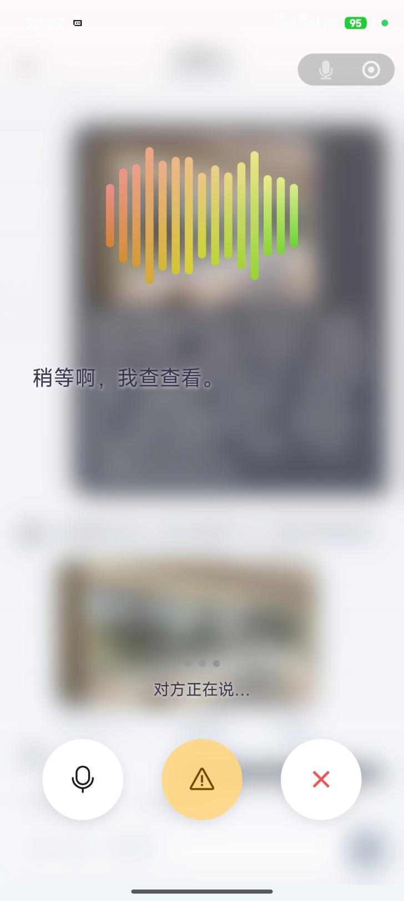
   拍照看效果（选照片后挑选产品生成预览）· 实时语音对话

### 产品与方案

产品卡片支持「对话推荐 / 为你匹配」双通道，勾选即进入方案；方案含配置明细与预估价，一键提交匹配商家。

  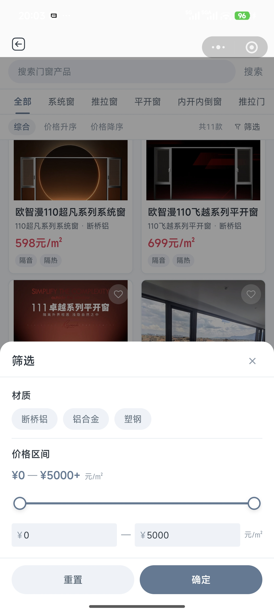
  
  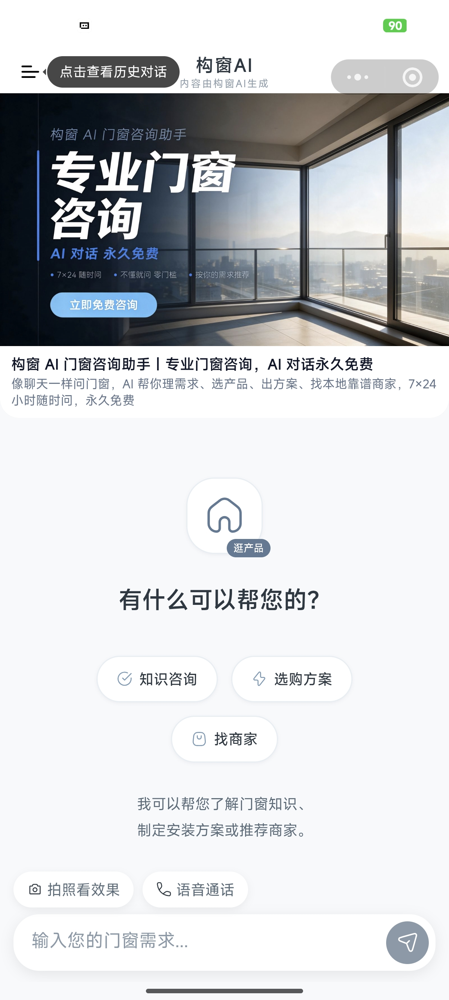
   产品中心 · 方案详情 · 追问建议（勾选下一轮自动带上）

## 六、商家端与评价闭环

  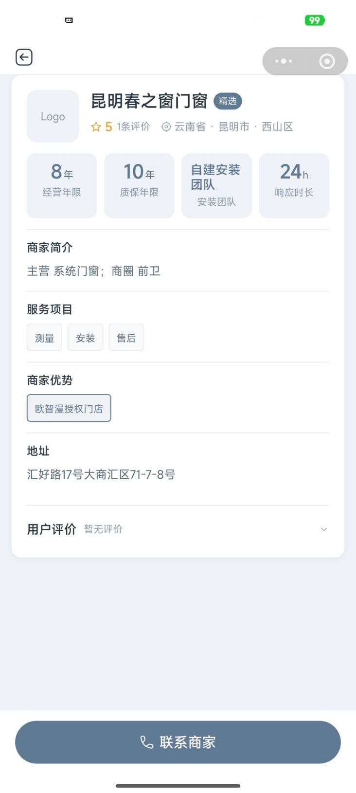
  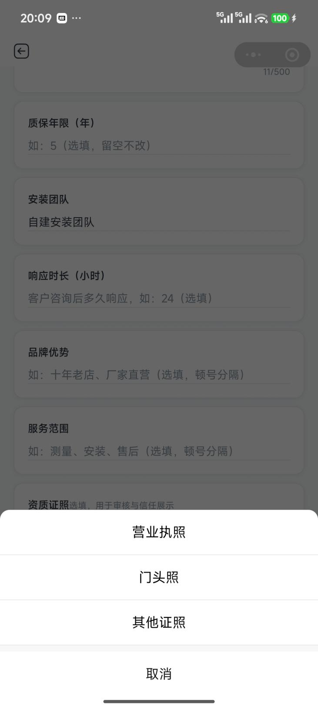
  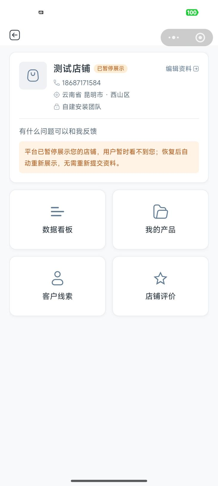
   商家详情（资质/口碑/一键联系）· 入驻申请 · 经营看板

**商家端能力**（小程序分包，与用户端同源一体）：

- 入驻申请：资质证照上传 + 平台审核，通过即生效
- 产品管理：上架 / 编辑，平台审核后生效（待审期间原内容继续展示）
- 客户线索：跟进状态管理（待联系 / 已联系 / 已成交 / 无效）
- 评价管理、经营数据看板、安装客户档案

**评价闭环**：评价强制绑定 已匹配方案 + 签约商家 + 合同号 + 完工实拍图，经平台人工审核后公开展示，从机制上保证真实性。

  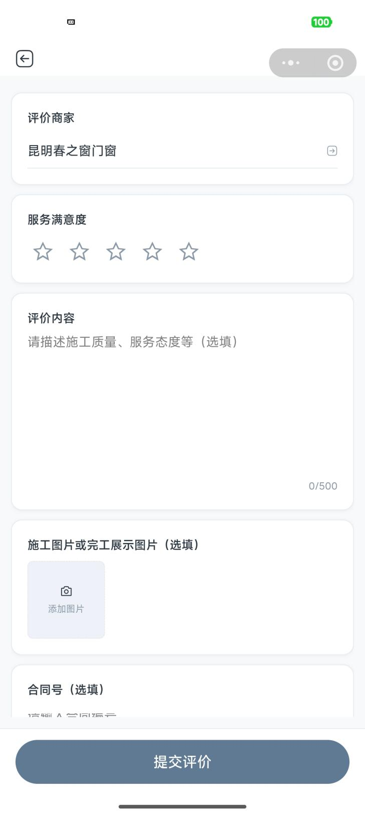
   提交评价：星级 + 施工图片 + 合同号

## 七、运营管理后台

  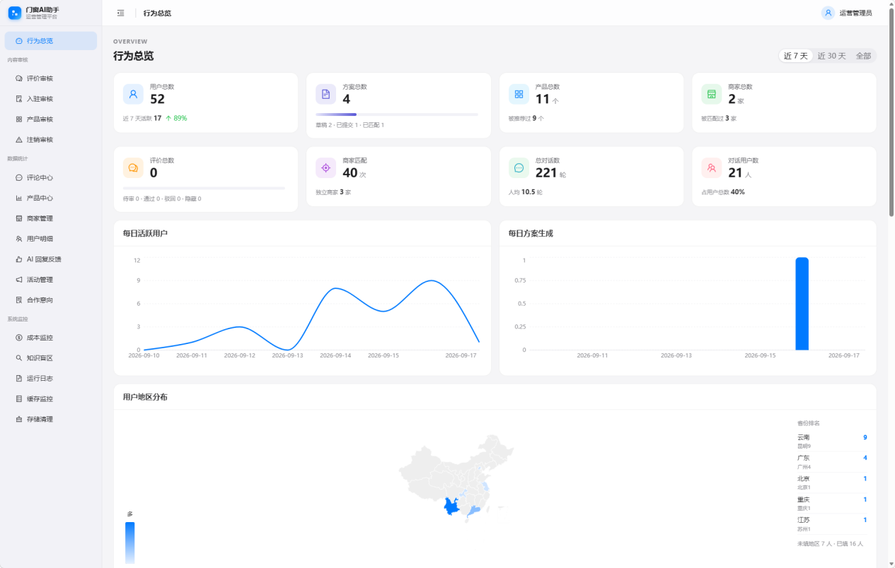
  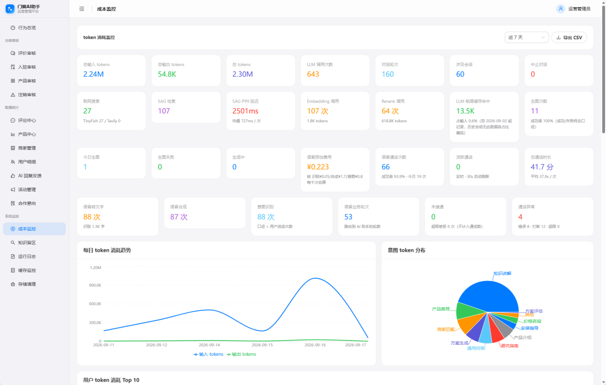
   行为总览（用户/方案/匹配/地区分布）· 成本监控（token 逐项计量 + 意图分布）

- **行为总览**：用户、方案、评价、商家匹配全指标 + 每日趋势 + 地区分布
- **多重审核**：商家入驻、产品上架、用户评价、账号注销
- **成本监控**：LLM / Embedding / Rerank / 联网 / 语音 / 生图 token 与费用逐项计量，按意图维度分析
- **知识盲区运营**：AI 回答欠佳的问题自动暴露给运营，指导知识库补强 —— 持续进化的数据飞轮

## 八、技术架构

### 三层协同

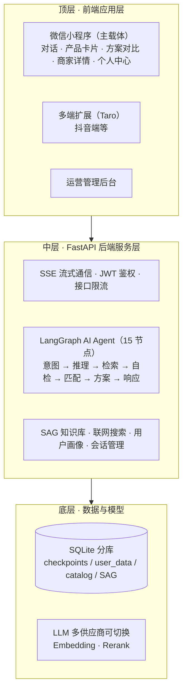

### Agent 节点拓扑（真实运行图）

**核心链路 9 节点**（意图解析 → 上下文构建 → 隐含需求推理 → 策略决策 → 三路检索 → 联网补充 → 流式生成 → 幻觉检测 → 格式化输出）**+ 业务分支 6 节点**（产品匹配 / 产品介绍 / 商家匹配 / 售后支持 / 方案生成 / 画像沉淀）。

  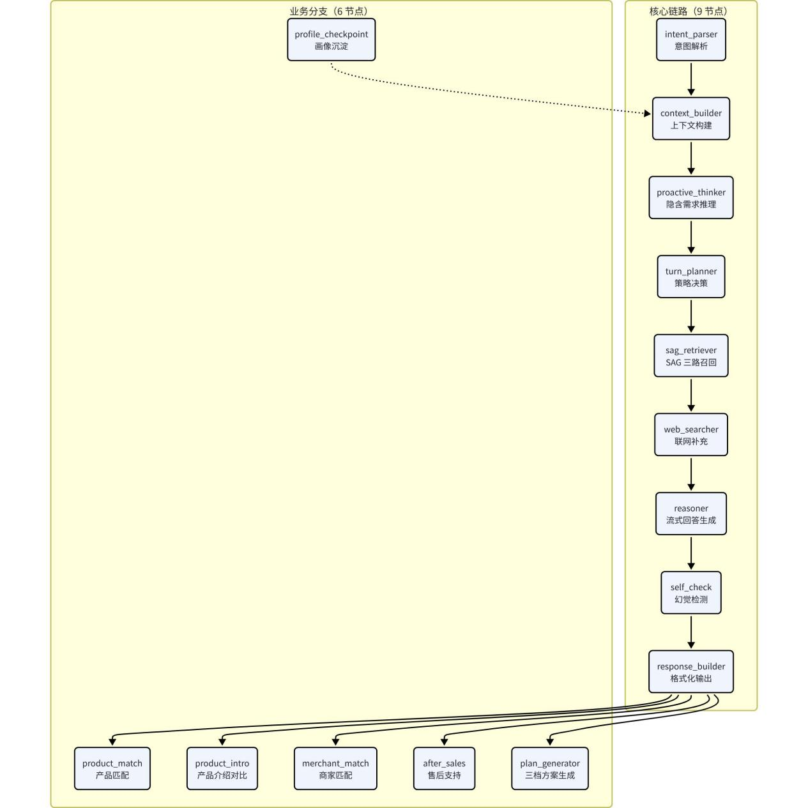

### 核心技术机制

| 机制 | 实现 |
|---|---|
| 三路召回 | Entity 抽取（11 维）→ SQL（结构化）+ 向量（语义）+ BM25（关键词）三路并行召回 → 合并去重 → Multi-hop 多跳 → Rerank 精排 → Top-K |
| 三层画像 | 对话内画像（槽位，单会话不落库）/ 用户画像（跨会话，用户自主保存）/ 对话记忆（摘要）—— 懂你，但不侵犯隐私 |
| 幻觉控制 | 快速校验：引用 / 覆盖度 / 标准号 / 数值 四类零成本代码检查；深度检查：LLM 语义级事实核查；引用占位符机制确保来源标注 100% 准确 |
| 流式体验 | 50ms 批量 flush，800+ token 长文流畅渲染；思考过程可视化；协作式中止 |
| 软评分匹配 | 10 维加权 + LLM 归一化兜底，非枚举输入也能精准匹配 |
| 成本工程 | 条件思考模式（轻量任务关闭深度思考）+ 语义缓存，逐轮成本埋点可审计 |

### 技术栈

| 层 | 选型 |
|---|---|
| 用户端 | 微信小程序原生（主载体）+ Taro 多端（可扩展至抖音端等） |
| 管理后台 | React + Vite + TypeScript + Ant Design |
| 后端 | Python 3.11 · FastAPI · LangGraph · SQLite |
| AI | 多 LLM 供应商配置化热切换 · 千问 Embedding / Rerank · 图生图 · 实时语音 |
| 检索 | 自建 SAG 知识库 · 向量 KNN + BM25 + 结构化 SQL 三路召回 |
| 基础设施 | 腾讯云（COS / 位置服务 / SMS）· Nginx · 云托管 |

## 九、商业模式

### 收入结构

| 收入方式 | 说明 |
|---|---|
| 成交佣金（CPS，主要收入） | 商家成交后收取约 5% 佣金 —— 落于门窗行业销售提成 5%–8% 的常见区间 |
| 用户返现（激励） | 从佣金中返现约 1% 给用户，激励上传合同与完工照片，印证真实成交 |
| 商家认证年费 | 认证商家明码标价、接受平台统一评估（规模化后）|
| 广告与增值服务 | 品牌曝光、推荐位、量尺预约、安装对接等（规模化后）|

### 成交归因与反套利机制

线下成交如何归因、如何防刷单，是行业平台的核心难题。构窗采用「**商家签约 + 用户凭证 + 双向对账**」三重机制：

1. **商家签约**：商家签署线索服务协议，明确佣金义务，抽成有契约依据
2. **用户凭证返现**：上传合同 + 完工实拍，核验通过后再打款返现，防止口头套利
3. **双向对账**：用户上报成交后同步商家确认，商家否认即标记可疑订单转人工复核
4. **保守测算**：财务模型按保守上报率执行，不把返现激励当作「跳单万能解」

### 商家为什么愿意付

对比「前置买线索」模式（先付费、效果未知），构窗采用「**成交后付费**」：商家无前置成本、心理阻力小；且 AI 已前置完成需求澄清与方案沟通，线索质量更高。

### 商业飞轮

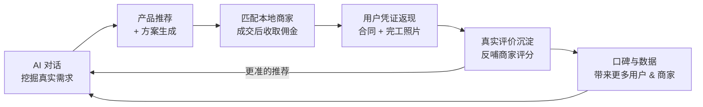

## 十、路线图

| 阶段 | 状态 | 内容 |
|---|---|---|
| MVP | ✅ 已完成 | 基础对话 + 知识科普 + 简单推荐 |
| V1.0（当前） | ✅ 已上线 | 完整导购 + 产品推荐 + 方案生成 + 商家匹配 + 幻觉控制；拍照看效果、评价体系已上线 |
| V2.0 | 规划中 | 多模态深化 + 智能量尺 + 供应链对接 |
| V3.0 | 规划中 | 安装监管 + 线上交易 + 招投标 |
| V4.0 | 愿景 | 行业平台化，向建材、家装、维修等相邻品类扩展 |

## 十一、仓库说明

- 本仓库为**项目展示仓库**，包含：
  - `screenshots/` —— 产品真实运行界面截图（用户端 / 商家端 / 管理后台）
  - `frontend/` —— 精选多端（Taro）前端代码节选，用于技术能力佐证
- **不包含**：后端源码、数据层与部署配置、商业与财务敏感信息
- 截图仅用于展示用途
- 开源协议：All Rights Reserved（保留所有权利）

---

构窗 · 让买门窗像点外卖一样有底

